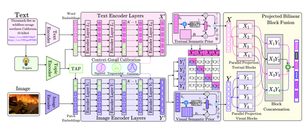

<div align="center">


# CAFuNet: Context-Aligned Fusion Network for Multimodal Crisis Informatics

**ACL 2026**

[]()
[]()
[]()
[]()

</div>

## Abstract

Multimodal social media data during crisis events presents significant challenges for classification due to noisy visual content, short or ambiguous text, and weak alignment between modalities. We propose **CAFuNet** (Context-Aligned Fusion Network), a multimodal classification architecture designed for humanitarian event analysis. CAFuNet introduces three components:

1. **Dual Topic-Conditioning Mechanism (TGP)** — injects corpus-induced topic representations into both visual and textual encoders to provide shared semantic conditioning.
2. **Context-Gated Calibration (CGC)** — modulates feature magnitudes based on their consistency with the shared context using parameterized fuzzy membership functions.
3. **Projected Bilinear Block Fusion (PBBF)** — captures low-rank multiplicative interactions between modalities.

Experiments on **CrisisMMD** and **TSEqD** benchmarks show that CAFuNet consistently improves macro-F1 over strong multimodal baselines, achieving gains of **+3.27** and **+2.61** points, respectively.

## Architecture

<p align="center">
  
</p>

## Datasets

We evaluate on two crisis informatics benchmarks:

- **[CrisisMMD](https://crisisnlp.qcri.org/)** (Alam et al., 2018) — image-text pairs from Twitter covering seven major natural disasters (2017). We use the humanitarian categorization task with official splits.
- **[TSEqD](https://doi.org/10.1016/j.eswa.2024.125337)** (Dar et al., 2025) — multimodal data from the 2023 Turkey-Syria earthquake with humanitarian labels. We use a stratified 80:10:10 split.

## Installation

**Prerequisites:** Python 3.10+, CUDA 12.6+ GPU (24 GB+ VRAM), [Conda](https://docs.conda.io/en/latest/)

```bash
git clone https://github.com/<your-username>/cafunet-acl2026.git
cd cafunet-acl2026

conda create -n cafunet python=3.10 -y
conda activate cafunet

pip install torch torchvision --index-url https://download.pytorch.org/whl/cu126

pip install transformers open-clip-torch timm clip sentence-transformers \
            bertopic umap-learn hdbscan scikit-fuzzy einops \
            pandas scikit-learn matplotlib plotly pydantic pyyaml \
            nltk tqdm pillow
```

### Data Preparation

1. **CrisisMMD**: Download from [CrisisNLP](https://crisisnlp.qcri.org/) and place under:
   ```
   ../Multimodal-Disaster-Classification/multimodal-disaster-datasets/crisis-mmd/
   ```

2. **TSEqD**: Obtain following [Dar et al., 2025](https://doi.org/10.1016/j.eswa.2024.125337) and place at:
   ```
   ./multimodal-disaster-datasets/tseqd/updated_TSEQD_datasetfile.tsv
   ```

## Usage

### Topic Induction

CAFuNet uses **BERTopic** to extract domain-specific topics offline. Run topic induction before training:

```bash
python -m topic_modelling.crisis_mmd   # CrisisMMD
python -m topic_modelling.tseqd        # TSEqD
```

Set `train_bert_topic: true` in `config.yaml` to re-train topics during the main run, or `false` to load from disk.

### Training

All configuration is managed through `config.yaml`. To switch datasets, update `crisis_mmd_like_dataset_to_use` (`crisis_mmd_dataset` or `tseqd_dataset`).

```bash
python run.py
```

### Evaluation

```bash
python test_run.py
```

Loads the best checkpoint and writes metrics to `test_run_logs/`.

## Citation

```bibtex
@inproceedings{cafunet2026,
    title = "Context-Aligned Topic Conditioning and Calibrated Fusion for Multimodal Crisis Informatics",
    booktitle = "Proceedings of the 64th Annual Meeting of the Association for Computational Linguistics (ACL 2026)",
    year = "2026",
}
```

## License

This project is licensed under the [MIT License](LICENSE).
